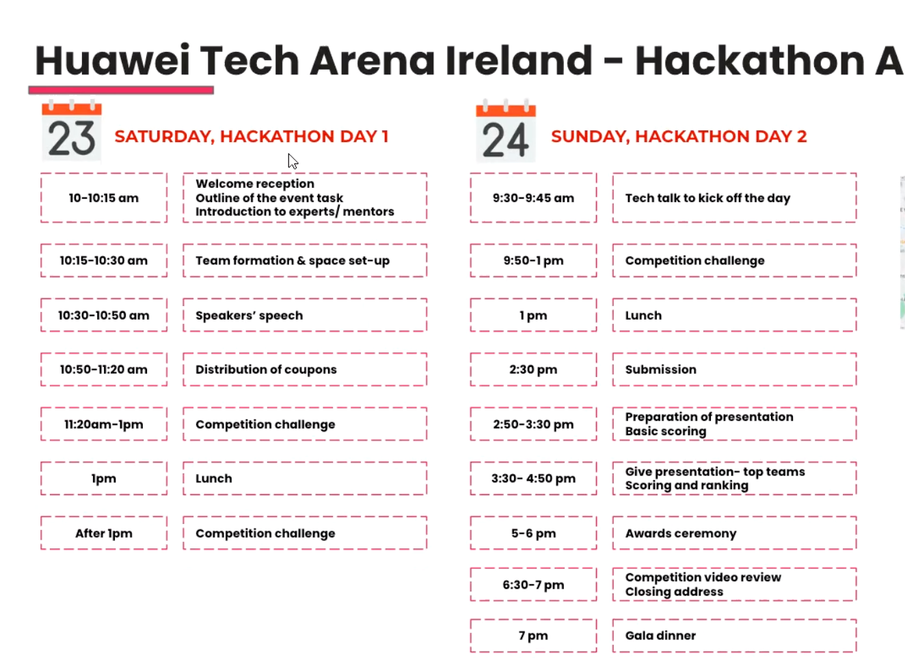
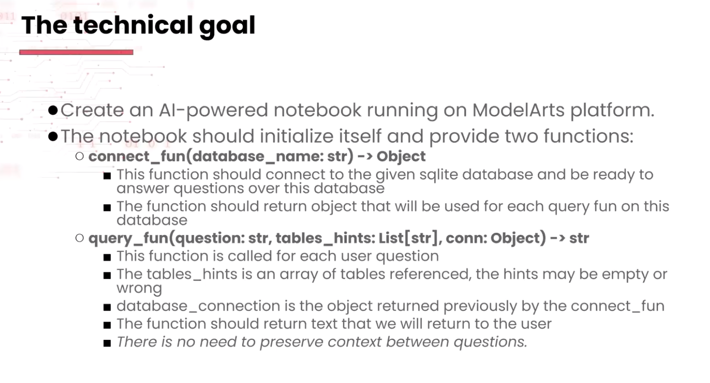
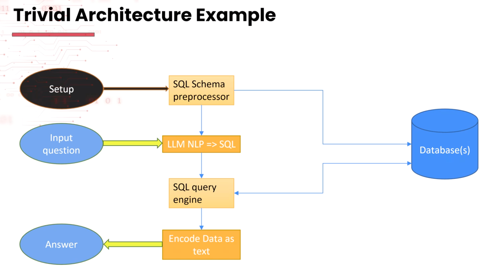
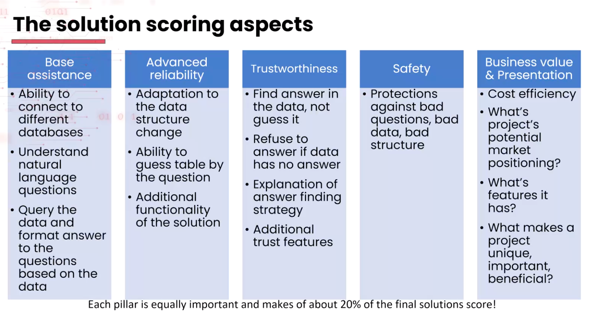

# [Huawei Tech Arena 2023](https://huawei.agorize.com/en/challenges/irchack2023/)
<p align="center">  </p>

## Competition Detail

<p align="center">  </p>

<p align="center">  </p>

<p align="center">  </p>

<p align="center">  </p>


## Setup
- Execute the following command:
```
cd huawei-arena-2023
pip install -e .
```

- Use the notebook: [infection-sql-UI.ipynb](./notebooks/infection-sql-UI.ipynb)

## Docker
- Build docker using
```
cd huawei-arena-2023
DOCKER_BUILDKIT=1 docker build -t huawei:latest .
```

- Run docker using
```
docker run -it -p 8008:8008 --gpus all huawei:latest
```

- Inside docker container, run notebook using
```
sh jupyter.sh
```


## Possible solutions:

1. Use defog/sqlcoder from huggingface
2. Use LLaMa2 from huggingface but needs finetune since performance really bad: https://medium.com/llamaindex-blog/easily-finetune-llama-2-for-your-text-to-sql-applications-ecd53640e10d
3. Use text-to-SQL LM (not LLM) like T5 and FLAN also from HuggingFace:
    - https://huggingface.co/juierror/text-to-sql-with-table-schema
    - https://huggingface.co/cssupport/t5-small-awesome-text-to-sql
4. Use CodeS: https://github.com/RUCKBReasoning/codes


## To-dos
- [x] End-to-end pipeline
- [x] Convert schema description from database to sqlcoder's db schema format
- [ ] Verify input string for potential danger (LLM?)
- [ ] Handle execution error 
- [ ] SQL injection test
- [ ] Prompt injection test
- [ ] Check if the model can explain the answer generation workflow 
- [ ] Loop for following-up questions ...


## Issues

- SQLCoder oftens generate query in snake_case regardless of input schema. If schema tables or columns' names are in CamelCase, it will lead to error. Similar issue was opened in https://github.com/defog-ai/sqlcoder/issues/17
- When using Llama2, it is recommened to use its specific [prompt template](https://gpus.llm-utils.org/llama-2-prompt-template/)
- Tips to prevent SQL model from hallucination: https://blog.langchain.dev/llms-and-sql/
