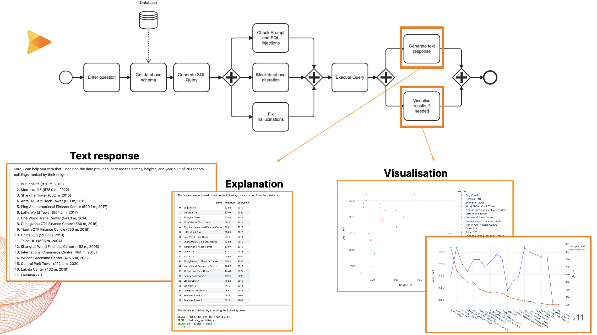

#  Infection Team's solution for the [Huawei Tech Arena 2023](https://huawei.agorize.com/en/challenges/irchack2023/)

We are team Infection. This repository demonstrates our methods in the Huawei Hackathon 2023 in Dublin, Ireland. We were awarded the runner-up among more than 70 teams of university participants.

A brief introduction of the hackathon:
> Modern world stores a lot of semi-structured data with SQL-like interfaces in Data lakes. Access to the data requires special skills and creativity to extract the gems of the insights out of them. Chat-style access to the data will provide great synergy of human and AI in analyzing the data. The market already has Data Assistants that translates the human idea into a query or series of queries and summarize the answers. It is important that the human can rely on the answers and be able to validate them. In this 2-days hackathon, we are asked to make use of all the cloud power the ModelArts to make the most reliable and trustworthy Data Assistant to co-pilot through the Data Lakes!


<p align="center">  </p>

## Infectious SmartQuery Solution

<p align="center">  </p>

Our end-to-end architecture solution employs multiple state-of-the-art Large Language Models, each responsible for specific aspects of our system's modules. This approach ensures the intelligence, reliability, safety, and trustworthiness that businesses require in their applications. Additionally, we have successfully deployed our system on Huawei's cloud platform and integrated several of its developer-friendly tools to streamline our development process.

<details close>
 <summary><strong>Implementation details</strong></summary>
 <p align="justify">
    We use <a href="https://huggingface.co/defog/sqlcoder">SQLCoder</a> to turn natural language prompts and data schemas into SQL queries. Then, we run the queries through <a href="https://huggingface.co/cssupport/mobilebert-sql-injection-detect">MobileBERT</a> to make sure no malicious queries are allowed like injecting malware or altering the database without permission. Once we've filtered out the bad queries, we format the queries using predefined heuristic rules and text processing techniques. After that, we execute the queries and get the responses back from the database. And finally, we choose <a href="https://huggingface.co/meta-llama/Llama-2-13b-chat-hf">Llama2</a> as our go-to chat assistant who puts together answers for us based on all the gathered infomation.
 </p>
</details>

## Setup
- Execute the following command:
```
cd huawei-arena-2023
pip install -e .
```

- Use the notebook: [infection-sql-gpu.ipynb](./notebooks/submission/infection-sql-gpu.ipynb)

## Docker
- Build docker using
```
cd huawei-arena-2023
DOCKER_BUILDKIT=1 docker build -t huawei:latest .
```

- Run docker using
```
docker run -it -p 8008:8008 --gpus all huawei:latest
```

- Inside docker container, run notebook using
```
sh jupyter.sh
```

## HuaweiCloud Tools
Finally, we give our thanks to Huawei for providing us with these tools from their [Huawei Cloud platform](https://www.huaweicloud.com/intl/en-us/) for our solution:
- ModelArts for deploying LLMs models, and executing through notebook interface.
- OBS for large storage of data points and model weights.
- SWR for maintaing container images, incredibly useful for reproducibility